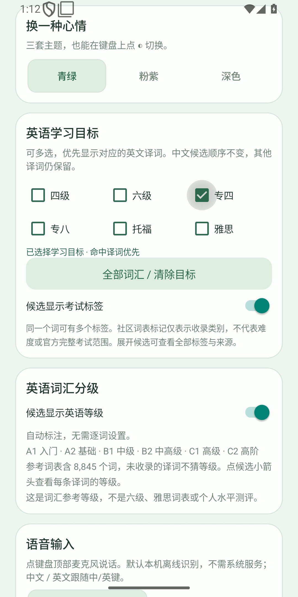
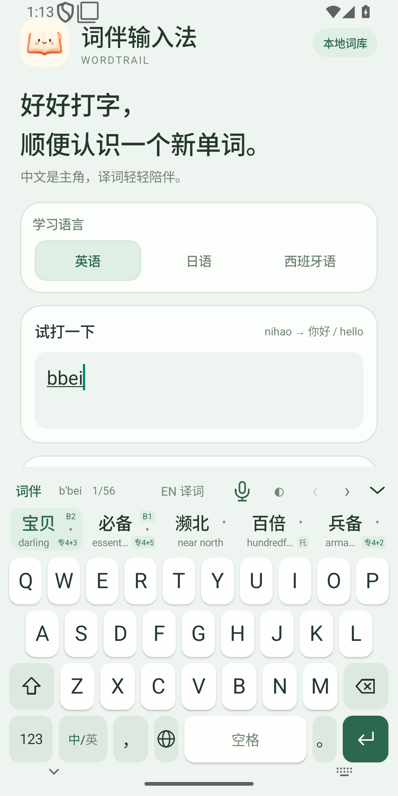
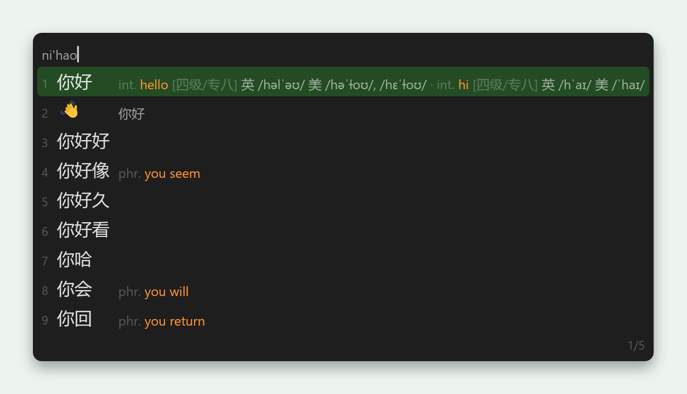

<div align="center">
  
  <h1>词伴 Wordtrail</h1>
  <p>好好打字，顺便认识一个新单词。</p>
  <p>Windows 音标增强 · Android 双语键盘与离线语音 · iOS 键盘源码</p>
</div>

词伴基于 [青简 qingjian](https://github.com/qingjian-team/qingjian) 开源内核，输入中文时，在候选旁显示外语释义、词性和英语音标，让学习融入日常打字。这是个人维护的独立改版项目，**不是青简官方产品**。

## 下载

当前发布为 **v0.1.8**。各平台版本独立：Android **0.1.8**，Windows 补丁 **0.1.2**。

| 下载 | 用途 |
| --- | --- |
| [Android 安装包](https://github.com/dakaizigitup/wordtrail/releases/download/v0.1.8/wordtrail-0.1.8-debug.apk) | Android 8.0+，64 位 ARM 手机/平板；约 240 MiB，已含离线语音模型 |
| [Windows 音标补丁](https://github.com/dakaizigitup/wordtrail/releases/download/v0.1.8/wordtrail-windows-ipa-0.1.2.zip) | 已安装官方青简 Windows 0.1.4 的用户；提供安装和恢复脚本 |
| [完整对应源码](https://github.com/dakaizigitup/wordtrail/releases/download/v0.1.8/wordtrail-0.1.8-source.zip) | Windows、Android、iOS 源码及固定第三方依赖/词库；不含工具链和私钥 |
| [SHA-256 校验和](https://github.com/dakaizigitup/wordtrail/releases/download/v0.1.8/SHA256SUMS.txt) | 核对发布附件 |

后续版本请查看 [Releases](https://github.com/dakaizigitup/wordtrail/releases) 和 [CHANGELOG](CHANGELOG.md)。**目前没有 iOS IPA 或 macOS 音标补丁。**

## 当前功能

| 功能 | Android 0.1.8 | Windows 补丁 0.1.2 | iOS 源码 |
| --- | --- | --- | --- |
| 中文拼音候选与外语释义 | 已实现 | 复用官方青简 | 已实现，未编译 |
| 英语 / 日语 / 西班牙语释义 | 每次显示一种 | 复用官方设置 | 每次显示一种，未验证 |
| 英式 / 美式英语音标 | 展开候选详情查看 | 各英语释义旁注 | 展开详情，未验证 |
| 英语 CEFR A1–C2 自动参考分级 | 8,845 词，默认显示 | 尚未加入补丁 | 已加入源码，未验证 |
| 英语考试目标、多标签与译词优先 | 六类多选，已实现 | 六类多选，已实现 | 已加入源码，未验证 |
| 中文 / 英文本机离线语音 | 已实现，不依赖系统语音服务 | 未新增 | 未新增 |
| 青绿 / 粉紫 / 深色主题 | 可切换 | 官方外观 | 已加入源码，未验证 |
| 手机 / 平板自适应 | 已实现 | 不适用 | 已加入源码，未验证 |

Android 同时提供中英切换、数字/符号键盘、主动收起按钮、紧凑候选行、可滚动的释义/多音标详情。新译词标橙、熟悉译词变灰；保留本地学习机制。

**已支持四级、六级、专四、专八、托福、雅思六类学习目标，支持多选与同词多标签。** 命中目标的英文译词优先，中文候选顺序不变；原有译词仍保留。社区收录标签与 CEFR 分开，不等于官方完整考试范围、考试成绩或个人水平。专业领域类别后续增加。详见 [0.1.8 使用说明](docs/0.1.8词汇目标.md)。

## 安装与使用

### Android

1. 下载 APK，在手机文件管理器打开安装。已有同签名词伴版本可直接覆盖安装，保留设置与学习数据。
2. 打开“词伴输入法”，点“① 启用词伴键盘”，再点“② 切换到词伴”。
3. 在输入框输入 `nihao`：候选显示“你好”和 `hello`。点候选输入中文；长按候选输入译词。
4. 点候选小箭头或向下滑查看完整释义、等级及英式/美式音标；点“EN 译词”切换学习语言。
5. 在首页“英语学习目标”选择类别，可多选；全部词汇保留，命中目标的译词优先。详情可逐条输入译词。
6. “中/英”切换输入模式，◐ 切换主题，右上角向下箭头收起键盘。点击麦克风后授权录音，说话并点“完成”插入文字；“取消”不会插入。

语音默认使用随包 SenseVoice int8 + sherpa-onnx + Silero VAD，本机处理，不上传或保存录音。首次准备模型需要额外空间，建议预留约 1 GB。可选系统语音只在设备提供公开识别服务时可用；选择该方式时服务可能联网。

更多操作见 [安装与测试指南](docs/安装与测试指南.md)。

### Windows

1. 从 [青简官方 v0.1.4](https://github.com/qingjian-team/qingjian/releases/tag/v0.1.4) 安装 Windows 版。
2. 下载并完整解压本项目的 Windows 音标补丁，结束正在输入的拼音，运行 `install.cmd`，按系统提示授予管理员权限。
3. 用 `Win + 空格` 切换到青简，在偏好设置选择英语；输入 `nihao` 即可看到英语释义旁的英式/美式音标。
4. 运行补丁目录里的 `settings.cmd` 多选英语学习目标，保存后约一秒生效。
5. 若要恢复安装前的服务，运行 `rollback.cmd`。保留整个补丁目录及安装时生成的 `backup/`。

补丁只替换候选窗口服务并增加音标文件，保留原输入法 DLL、输入协议、词库与用户数据。补丁尚无官方数字签名；管理员宿主窗口等特殊场景未充分验证。详见 [Windows 补丁说明](docs/电脑版音标补丁.md)。

### iOS

仓库提供宿主应用与系统键盘扩展源码、音标/等级和同款图标资源。需要 Mac、Xcode 和签名后才能安装；本项目尚未执行 iOS 编译或真机验证，**不要将源码支持理解为已有可安装版本**。

## 界面预览






更多 [主题预览](docs/主题预览.html)、[本版验证记录](docs/0.1.8测试报告.md) 与 [初版测试报告](docs/测试报告.md)。

## 实现基底

中文候选来自青简拼音内核与本地词库。英文、日文和西班牙文释义是随包的离线数据，按候选词查表；英语音标来自独立 IPA 词典，共 **147,488 个词条**，按单词查询英式 RP / 美式 GA 数据。CEFR 等级同样通过固定词表查询。

日常拼音、释义、音标、等级和默认语音都在本机处理。Android 应用没有 `INTERNET` 权限；开发构建时的数据下载与安装包内的日常运行是不同阶段。

这仍是实验版：没有九宫格、手写、滑行输入、表情面板或完整的学习统计页，也没有移植桌面的整句神经模型。当前发布以可用的输入与辅助学习为主。

## 开发与构建

| 目录 | 内容 |
| --- | --- |
| `native/` | 共享 Rust 会话、候选、JSON / C ABI / Android JNI 与分级 |
| `android/` | Java 系统输入法、设置界面和离线语音 JNI |
| `ios/` | SwiftUI 宿主、UIKit 键盘扩展与 XcodeGen 工程描述 |
| `desktop/` | Windows 音标增强服务 |
| `vocabulary/` | 六类考试多标签索引与共享排序规则 |
| `pronunciation/` | 独立英式 / 美式音标数据与查询代码 |
| `vendor/qingjian/` | 固定版本的上游源码和数据来源说明 |
| `scripts/` | 构建、数据准备、打包与发布 |
| `tests/` | 引擎、输入连接、布局、快速触屏和语音流程检查 |

Git 仓库保留日常可维护源码；大型构建产物、第三方依赖副本、生成词库和模型权重不提交 Git。**Release 的完整源码 ZIP 包含对应的第三方源码和数据**，用于审查、构建及保留完整许可。

克隆后，先恢复与本版匹配的依赖和词库：

```powershell
git clone --recurse-submodules https://github.com/dakaizigitup/wordtrail.git
cd wordtrail
python scripts/bootstrap_dependencies.py
```

也可指定已下载的对应源码：

```powershell
python scripts/bootstrap_dependencies.py --source-zip C:\Downloads\wordtrail-0.1.8-source.zip
```

该脚本只恢复被 Git 忽略的第三方依赖和生成词库，不覆盖当前开发代码。构建还需要 Python 3.11+、Rust 1.96、JDK 21、Android SDK 35 / Build Tools 35.0.0 / NDK 28.2.13676358，Windows 服务构建还需对应 GNU 链接工具。现有 PowerShell 脚本默认读取作者本机的工具链配置，**其他电脑需先调整路径和 `toolchain.json`**；仓库并未提供完整工具链安装器。

Android：`scripts/build_android.ps1`；Windows：`scripts/build_desktop.ps1`；iOS：Mac 上执行 `scripts/build_ios.sh`。详细步骤、来源固定方式和验证边界见 [开发说明](docs/开发说明.md)。

## 后续版本

六类考试目标已接入；计划加入更多专业词汇目标、可选词汇包、学习统计与复习功能，并继续优化离线语音和键盘体验。词表来源、许可、分级依据和跨平台行为会逐项确定，未完成的功能不会写成已实现。详见 [ROADMAP](ROADMAP.md)。

欢迎提交 Issues 与 Pull Request，见 [CONTRIBUTING](CONTRIBUTING.md)。

2026-10-05 已完成第一阶段 [词库调研与多标签设计](docs/词库调研与多标签设计.md)，包括实际数据去重、来源检查与索引速度原型。2026-10-06 已在 Android 0.1.8 / Windows 补丁 0.1.2 接入六类目标与多标签。

## 来源与许可

新增代码采用 **GPL-3.0-or-later**，见 [LICENSE](LICENSE)。青简固定为 v0.1.4、提交 `f7abaefcb1a3aeaca5c01692941a64a7b1f43eb5`；本项目使用独立名称与原创图标，没有使用青简官方 logo。

音标、CEFR 词表、释义数据、语音模型及依赖各有来源和许可，不能统称 GPL。完整声明与许可全文见 [NOTICE.txt](NOTICE.txt)、[Windows 许可声明](desktop/NOTICE.txt) 和 [第三方语音资源](third-party/sherpa-onnx/)。修改数据或分发衍生版本时请保留对应署名、许可及源码义务。
