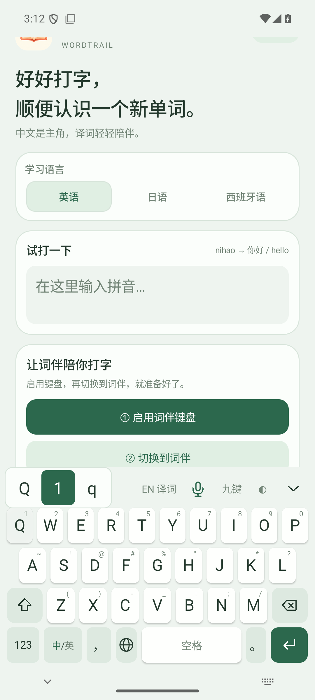

# 词伴 Android 0.1.38 发布说明

本次将 0.1.31–0.1.38 的移动端修改整合发布：九键、本机个性选词、等高候选网格、适配布局、即时设置、按键长按选字、候选触感，以及26键大小写同时选择。

## 使用

- 同签名测试版本可覆盖安装，不用卸载；按键布局在首页或键盘顶栏切换。
- 九键输入 `64426` 可给出“你好”，左侧筛选读音，右侧删除/重输；重输清除未完成拼音，保留已提交文字。
- 候选右侧箭头展开网格并隐藏按键，点“返回键盘”恢复；音标详情也占用原按键区，系统返回键先关闭面板。
- 高度和底部留白选择后立即变化，不清除输入中的拼音；切换九键/26键会清除未完成拼音。
- 九键长按有 `M N O 6 m n o`；26键有 `Q 1 q`、`L ? l`。滑到选项后松手，字符按大小写直接输入，保留触感反馈。

## 验证

发布包的行为代码与开发阶段验证一致；发版整理同步开源许可文本中的应用版本及对应源码文件名。

- [Android 0.1.36 布局记录](evidence/android-0.1.36-layout-tests.json)：4种设备尺寸/字体配置，44项检查。
- [即时设置与长按手势](evidence/android-0.1.36-settings-longpress-tests.json)：68项检查。
- [快速触屏输入](evidence/android-0.1.36-rapid-typing-tests.json)：120/60/30ms间隔，从有候选/无候选状态输入，6组均无漏字。
- [选字震动](evidence/android-0.1.37-haptics-verification.json)：候选与长按最终选择触发系统 `KEYBOARD_TAP`。
- [26键大小写](evidence/android-0.1.38-lowercase-verification.json)：中文/英文模式、大写/小写与数字/符号，36项检查。
- 移动 Rust 7项测试通过，含九键候选、本机学习、重输隐私状态及字母原文输入；APK签名与16KB对齐通过。

模拟器为 Android 35。测试不能覆盖用户所有品牌真机的导航栏、震动手感和录音设备差异；iOS仍仅提供源码。

## 开发与数据

仓库保留可维护源码和固定上游子模块。源码ZIP包含对应依赖、词库输入、数据来源、许可证、审校记录和构建器；编译前由 `scripts/apply_upstream.py` 应用可校验的本地兼容补丁，不需要推送上游仓库。

移动词库沿用本地0.1.31数据：第38批NAER信息术语新增4组映射和52个来源词头关系，未宣称整个专业领域覆盖率。详见 [第38批记录](38-NAER信息术语补词.md)。Windows可下载版本继续为0.1.23，后续源码随仓库维护，本次没有上传新的Windows安装补丁。

下载与 SHA-256 校验文件在 [v0.1.38 Release](https://github.com/dakaizigitup/wordtrail/releases/tag/v0.1.38)。
