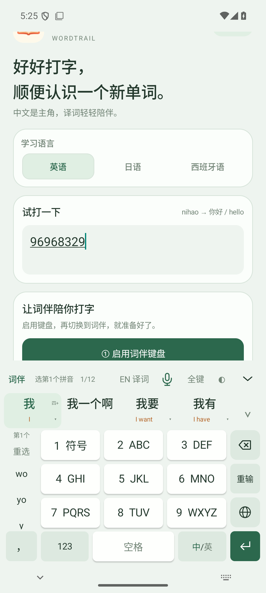

# Android 0.1.39：九键逐段筛选拼音

默认开启“九键拼音逐个选择”，也可以在首页“键盘布局与高度”中关闭，恢复0.1.38的整串读音选择。

## 操作

一次输入多个字的九键码后，左侧只显示第1个音节的可能拼音，例如 `wo`、`yo`、`w`。选 `wo` 后锁定第一段，再显示第2段的可能拼音，例如 `you`。继续选择 `fa`、`x`，完成 `wo · you · fa · x`，中文候选随选择更新。

- 顶栏显示已选拼音和当前选择步骤；左侧完整显示单个拼音，不再塞入长串读音。
- 点 `‹ 上一个拼音` 回退重选；点“重选”清除拼音约束，保留输入的数字。
- 选择拼音只筛候选，不提前把汉字上屏。可以随时选中文候选；如果先选“我”，未消费的九键码继续保留，接着筛下一个字。
- 追加按键保留已选拼音；删除进入某个已选音节时，只回退受影响部分。
- 读音栏可滑动，展开候选后也能逐段选；保留候选触感、大小写长按及本机隐私设置。

## 实现与验证

新增共享Rust九键模块，缓存音节数字编码，按已选音节的对应数字起点继续有界解码；不依赖截断的完整读音列表来产生下一个音节的选项。`reading_prefix`、`syllable_choices`、`reading_complete` 为新增状态字段，旧整串读音请求仍可用。

候选消费由青简内核完成，再把剩余原拼音映回九键码，避免剩余输入被自动固定成某个猜测的读音。只有实际选词时记个人选择，私密状态保持不学习。

移动Rust 10项测试通过，包含长输入逐段锁定、退回、输入删除、过期步骤拒绝、短候选后保留未决数字和私密输入。Android 35模拟器覆盖手机1080×2400/420dpi与平板2560×1600/240dpi；按用户示例 `96968329` 验证 `wo → you → fa → x`、回退、整串/逐段切换及选“我”后继续处理 `968329`。16位数字在120/60ms间隔的触屏输入完整保留；总耗时包含自动化等待，不作为每次按键延迟。

本版为本地测试包，APK versionCode 40。签名与16KB对齐通过；尚未连接用户真机验证。GitHub已发布版仍为0.1.38。

最终结果：30项逐段界面检查、2组快速九键触屏输入与10项移动Rust测试通过。APK SHA256：`24b80eca774ea36cc1fe24cdd8ac6fcb4db9760d2d7af3b6e2eeda02d28427eb`。验证记录见 `docs/evidence/android-0.1.39-*.json`。
